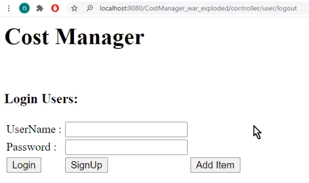
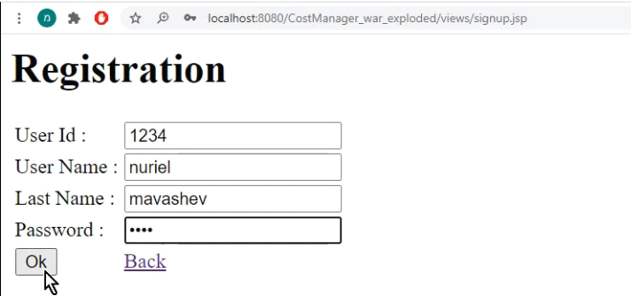
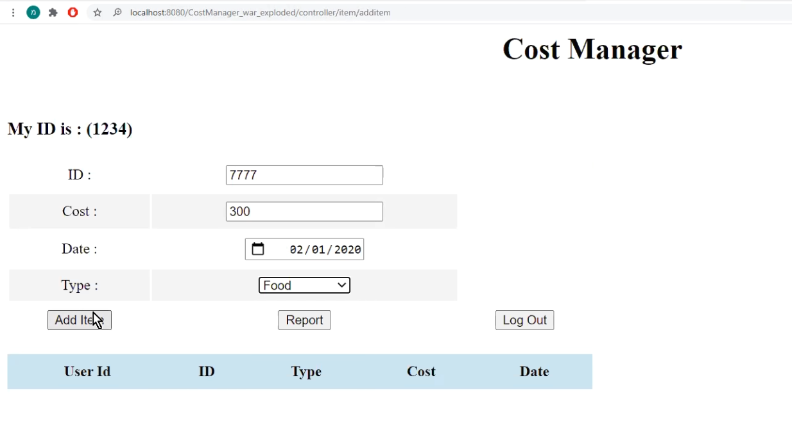
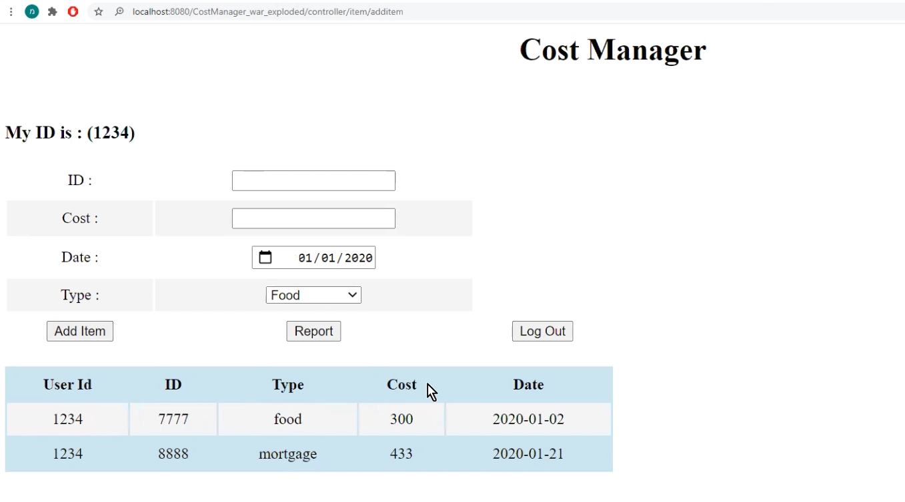
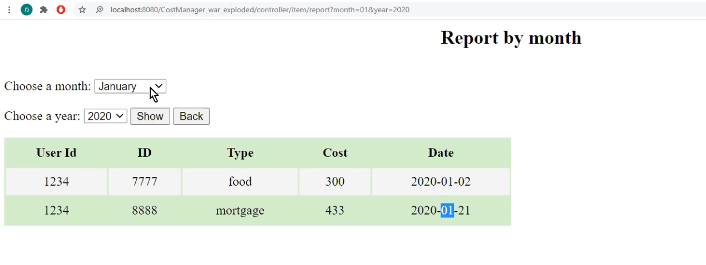

# Cost Manager Web Server Side

### Introduction
Web Application with Hibernate, cost manager.   
the app contains:  

1. Allowing the user to login/logout.  

2. Allowing the user to add an expense in one of the available expense types (food, clothes, car, housing…). 

3. Allowing the user to get a detailed monthly report for every month he selects. 

### Database 

MySQL

### Technology 
JAVA , CSS, JAVASCRIPT, HIBERNATE,HTML, SERVLET, JSP

### GIT
https://github.com/nuriel99/Cost_Manager_Web_ServerSide

### Youtube
https://youtu.be/JDsarlm36Ko

